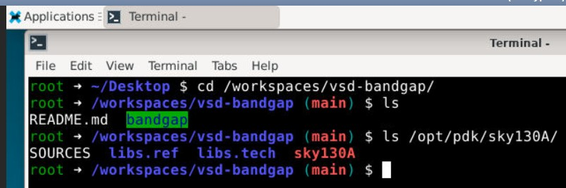

---

## VSD-BANDGAP Environment (Magic + Ngspice + Netgen)

This Codespace provides a ready-to-use **Analog Design and Simulation** setup on **Ubuntu 22.04**, featuring **Magic**, **Ngspice**, and **Netgen** with both **terminal** and **GUI (noVNC)** access.

---

### Step 1 – Open the Codespace

1. Go to the GitHub repository:
   **[https://github.com/vsdip/vsd-bandgap](https://github.com/vsdip/vsd-bandgap)**
2. Click **“Code” → “Open with Codespaces”** to launch the environment directly in your browser.


---

### Option 1 – Use the Terminal

Once the Codespace opens, go to the **TERMINAL** tab and run:

```bash
magic
```

or

```bash
ngspice
```

or

```bash
netgen
```

Exit anytime using `exit`.


---

### Option 2 – Use the GUI (noVNC Desktop)

1. In your Codespace, open the **PORTS** tab.
2. Find the forwarded port named **noVNC Desktop (6080)**.
3. Click the forwarded URL.
4. On the web page, select **`vnc_lite.html`** to open the XFCE desktop.
5. Inside the desktop terminal, run:

   ```bash
   magic
   ngspice
   netgen
   ```


---

### Installed Tools

| Tool    | Command   | Description               |
| ------- | --------- | ------------------------- |
| Magic   | `magic`   | Layout and DRC Tool       |
| Ngspice | `ngspice` | Circuit Simulation Tool   |
| Netgen  | `netgen`  | LVS (Layout vs Schematic) |

---

### Project Folder Location

The design files are available under the folder:
`/workspaces/vsd-bandgap`
as shown in the image below:



**SkyWater PDK files are available under the location:**
`/opt/pdk/sky130A/`

---

### Verify Installation

```bash
magic -v
ngspice -v
netgen -v
```

Each command should display version information confirming the installation.

---

